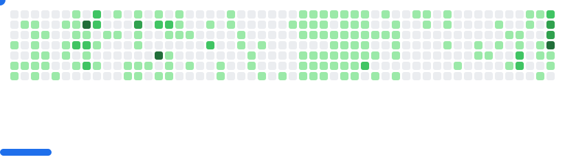

<h1 align="center">Hi  I'm Nitin Govardhane  </h1>
<b>A Computer Science student interested in building useful web applications, contributing to open-source, and improving as a full-stack web developer. I spend most of my time learning through practical projects, working on code that solves real problems, and collaborating with others whenever it helps the work move forward. My goal is to keep getting better by staying hands-on and curious.</b>

## 🕹️ Where My Commits Try to Escape

  <picture>
    <source media="(prefers-color-scheme: dark)" srcset="images/breakout-dark.svg" />
    <source media="(prefers-color-scheme: light)" srcset="images/breakout-light.svg" />
    
  </picture>
   

---

### s𝚑𝚘𝚠 𝚜𝚘𝚖𝚎 ❤️ 𝚋𝚢 𝚜𝚝𝚊𝚛𝚛𝚒𝚗𝚐 𝚜𝚘𝚖𝚎 𝚘𝚏 𝚝𝚑𝚎 𝚛𝚎𝚙𝚘𝚜𝚒𝚝𝚘𝚛𝚒𝚎𝚜

